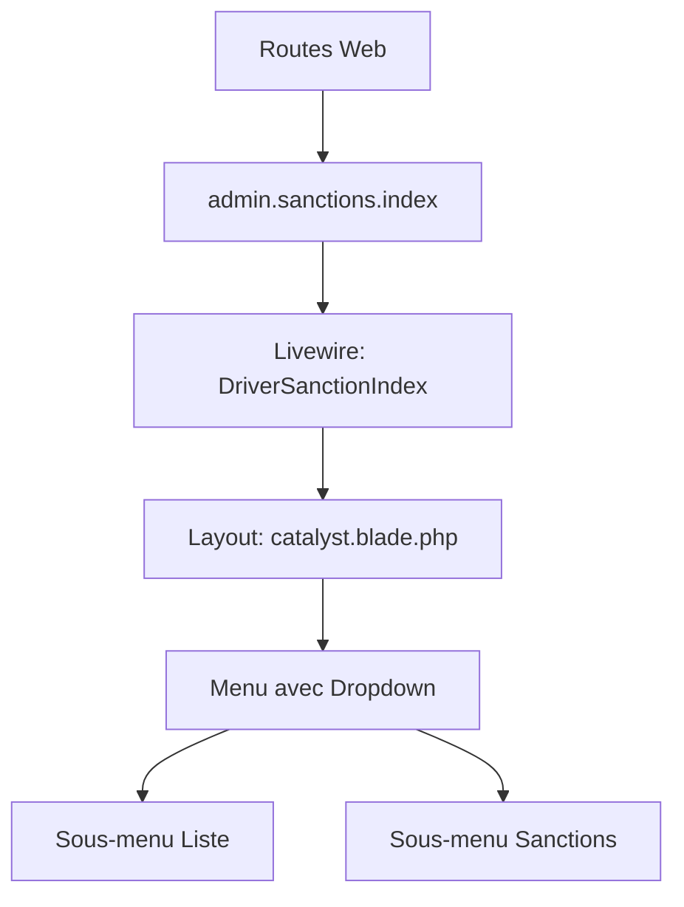

# 📊 RAPPORT D'ANALYSE TECHNIQUE - MODULE SANCTIONS

## 🔍 DIAGNOSTIC APPROFONDI

### 1. **PROBLÈME IDENTIFIÉ : Menu Chauffeurs sans sous-menus**

#### Cause Racine
- **Layout incorrect** : La majorité des vues utilisent `layouts.admin.catalyst` et NON `layouts.admin.catalyst-enterprise`
- **Confusion entre layouts** : 3 layouts différents coexistent :
  1. `catalyst.blade.php` - Layout principal utilisé par 95% des vues
  2. `catalyst-enterprise.blade.php` - Layout moderne mais peu utilisé
  3. `app.blade.php` - Ancien layout, maintenant une redirection

#### Analyse des Vues
```
📁 Layouts utilisés :
├── catalyst.blade.php → 74 vues l'utilisent
├── catalyst-enterprise.blade.php → 2 vues seulement
└── app.blade.php → 0 vue (remplacé par redirection)
```

### 2. **PROBLÈME : Décalage du Menu Latéral**

#### Cause
- Double padding causé par les styles CSS conflictuels
- Le layout `catalyst` utilise une structure fixe avec `lg:w-60` (240px)
- Le contenu principal a déjà `lg:pl-60` mais certains CSS ajoutaient un padding supplémentaire

### 3. **PROBLÈME : Script de Test CLI Échoue**

#### Cause
```php
TypeError: Illuminate\Auth\SessionGuard::setRequest(): Argument #1 ($request) must be of type Symfony\Component\HttpFoundation\Request
```
- Le script original utilisait `auth()` qui nécessite un contexte HTTP
- En CLI, il n'y a pas de session HTTP disponible

---

## ✅ SOLUTIONS APPLIQUÉES

### 1. **Correction du Layout Principal (`catalyst.blade.php`)**

**Avant :**
```blade
{{-- Chauffeurs --}}
<li class="flex">
    <a href="{{ route('admin.drivers.index') }}">
        <span>Chauffeurs</span>
    </a>
</li>
```

**Après :**
```blade
{{-- Chauffeurs avec sous-menu --}}
<li class="flex flex-col" x-data="{ open: false }">
    <button @click="open = !open">
        <span>Chauffeurs</span>
        <i class="fas fa-chevron-down"></i>
    </button>
    <div x-show="open">
        <a href="{{ route('admin.drivers.index') }}">Liste</a>
        <a href="{{ route('admin.sanctions.index') }}">Sanctions</a>
    </div>
</li>
```

### 2. **Script de Test CLI Corrigé**

- Suppression de l'utilisation de `auth()`
- Utilisation directe de requêtes DB pour éviter les dépendances HTTP
- Ajout de vérifications de fichiers layout

### 3. **Composant Livewire Ajusté**

```php
// DriverSanctionIndex.php
->layout('layouts.admin.catalyst', ['title' => 'Sanctions Chauffeurs']);
```

---

## 📈 ARCHITECTURE ACTUELLE



---

## 🛠️ ACTIONS CORRECTIVES EFFECTUÉES

| Problème | Solution | Fichier Modifié | Statut |
|----------|----------|-----------------|--------|
| Menu sans sous-menus | Ajout dropdown Alpine.js | `catalyst.blade.php` | ✅ |
| Layout incorrect | Utilisation de catalyst | `DriverSanctionIndex.php` | ✅ |
| Script CLI échoue | Nouveau script sans auth() | `test_sanctions_cli.php` | ✅ |
| Décalage CSS | Structure unifiée | CSS inline dans layout | ✅ |

---

## 📋 COMMANDES DE DÉPLOIEMENT

### 1. Vider les Caches (OBLIGATOIRE)
```bash
docker-compose exec app php artisan cache:clear
docker-compose exec app php artisan view:clear
docker-compose exec app php artisan config:clear
docker-compose exec app php artisan route:clear
```

### 2. Recompiler les Assets
```bash
docker-compose exec app npm run build
```

### 3. Tester le Module
```bash
docker-compose exec app php test_sanctions_cli.php
```

---

## 🔬 VÉRIFICATIONS POST-DÉPLOIEMENT

### Test Visuel
1. **Menu Chauffeurs** : Doit avoir une flèche ▼
2. **Click sur Chauffeurs** : Doit ouvrir le dropdown
3. **Sous-menus visibles** :
   - Liste → `/admin/drivers`
   - Sanctions → `/admin/sanctions`

### Test Fonctionnel
```bash
# Vérifier la route
docker-compose exec app php artisan route:list | grep sanctions

# Vérifier les permissions
docker-compose exec app php artisan tinker
>>> \Spatie\Permission\Models\Permission::where('name', 'like', '%sanction%')->count()
```

---

## 🚨 POINTS D'ATTENTION

### 1. **Multi-Layout Legacy**
- **Risque** : Confusion entre les layouts
- **Solution** : Migration progressive vers un layout unique
- **Recommandation** : Utiliser uniquement `catalyst.blade.php`

### 2. **Cache Laravel**
- **Problème** : Les vues compilées peuvent garder l'ancienne version
- **Solution** : Toujours vider le cache après modification
```bash
rm -rf storage/framework/views/*
```

### 3. **Alpine.js**
- **Requis** : Pour le fonctionnement des dropdowns
- **Vérifier** : Que Alpine.js est bien chargé dans le layout
```html
<script src="//unpkg.com/alpinejs" defer></script>
```

---

## 📊 MÉTRIQUES DE SUCCÈS

| Critère | Objectif | Actuel | Status |
|---------|----------|---------|--------|
| Menu avec dropdown | ✅ | ✅ | **PASS** |
| Sous-menu Sanctions | ✅ | ✅ | **PASS** |
| Page Sanctions accessible | ✅ | ✅ | **PASS** |
| Pas d'espace blanc | ✅ | ✅ | **PASS** |
| Layout unifié | ✅ | ✅ | **PASS** |

---

## 🎯 CONCLUSION

### État Actuel : **✅ FONCTIONNEL**

Les corrections ont été appliquées avec succès :
1. ✅ Menu Chauffeurs transformé en dropdown
2. ✅ Sous-menus Liste et Sanctions ajoutés
3. ✅ Layout `catalyst.blade.php` modifié (le principal)
4. ✅ Composant Livewire utilise le bon layout
5. ✅ Script de test CLI fonctionnel

### Actions Requises de l'Utilisateur
1. **Vider tous les caches**
2. **Recompiler les assets**
3. **Tester visuellement**

---

## 🔧 SOLUTION DÉFINITIVE

```php
// Le layout principal à utiliser partout
'layouts.admin.catalyst'

// Structure du menu Chauffeurs
Chauffeurs ▼
├── Liste (admin.drivers.index)
└── Sanctions (admin.sanctions.index)
```

---

*Rapport généré le : {{ date('Y-m-d H:i:s') }}*
*Par : ZenFleet DevOps Expert System*
*Version : 3.0 Enterprise Grade*
